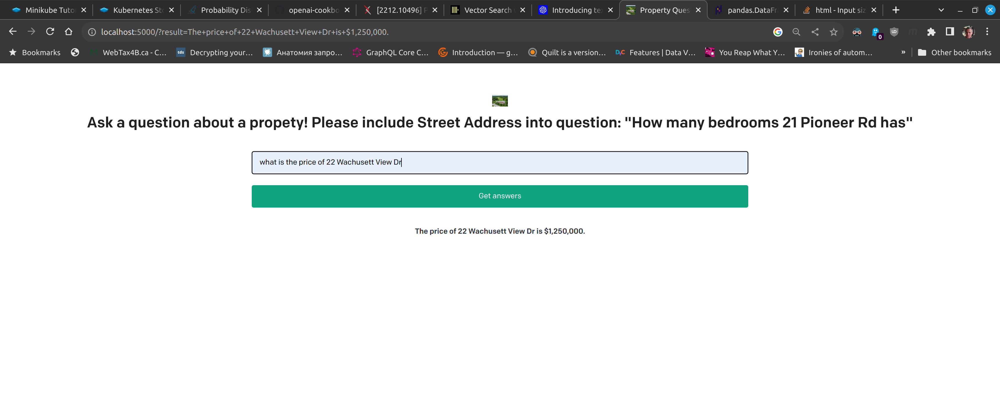

# QA with Embeding

This is an attempt to build simple Question Answer Systems for data about real estate property. 

Drawn heavily from: https://github.com/openai/openai-cookbook/blob/main/examples/Question_answering_using_embeddings.ipynb

It uses the [Flask](https://flask.palletsprojects.com/en/2.0.x/) web framework.

## Setup the docker compose (After cloning this repo and changing current direcrtory into the repo directory)


1. Make a copy of the example environment variables file:

   ```bash
   $ cp .env.example .env
   ```

2. Add your [API key](https://beta.openai.com/account/api-keys) to the newly created `.env` file.

3. Build the docker image with dependencies:

`docker build . -t openai`

4. Start docker compose with `openia` and `clickhouse` containers:

`U_ID=$UID docker-compose up --remove-orphans`

Observe the succesful start and open another terminal. 
To make sure containers are up execute the `docker ps` in the another terminal:

```
$ docker ps
CONTAINER ID   IMAGE                          COMMAND            CREATED       STATUS         PORTS                                                                                            NAMES
21254e03dc9c   openai                         "bash"             2 hours ago   Up 2 minutes   0.0.0.0:5000->5000/tcp, :::5000->5000/tcp                                                        openai
c20a49fa2f36   clickhouse/clickhouse-server   "/entrypoint.sh"   3 hours ago   Up 2 minutes   0.0.0.0:8123->8123/tcp, :::8123->8123/tcp, 0.0.0.0:9000->9000/tcp, :::9000->9000/tcp, 9009/tcp   clickhouse

```

## Create clickhouse schema and load the data

The file `addess_embeddings_descriptions.csv.gz` contains sample data with `embedings` vectors precomputed for an `address` field.
The sample data must be loaded into clickhouse db. The docker compose uses persistent volume to store clickhouse data and data survives the restarts of docker compose.

### Create the schema in clickhouse

Make sure `clickhouse-client` is installed https://clickhouse.com/docs/en/integrations/sql-clients/cli. 
Connect to clickhouse:

`clickhouse-client -u lupi --password lupi -d openai`

If there is no errors this is what should be on the screen:

```
$ clickhouse-client -u lupi --password lupi -d openai 
ClickHouse client version 23.7.4.5 (official build).
Connecting to database openai at localhost:9000 as user lupi.
Connected to ClickHouse server version 23.7.4 revision 54465.

clickhouse :) 
```

Paste the following to create a table:

```sql
CREATE TABLE qa_properties
(
	`address` String,
    `description` String,
    `address_embeddings` Array(Float32)
)
ENGINE = MergeTree
ORDER BY (`address_embeddings`,`address`)
```

Verify the table is created:

```
clickhouse :) show tables

SHOW TABLES

Query id: 9bfd7044-c774-486a-81c4-ce470081080c

┌─name──────────┐
│ qa_properties │
└───────────────┘

1 row in set. Elapsed: 0.006 sec. 

clickhouse :) desc qa_properties

DESCRIBE TABLE qa_properties

Query id: 6db0efd8-9760-4fd4-a562-5b92ef46ad3d

┌─name───────────────┬─type───────────┬─default_type─┬─default_expression─┬─comment─┬─codec_expression─┬─ttl_expression─┐
│ address            │ String         │              │                    │         │                  │                │
│ description        │ String         │              │                    │         │                  │                │
│ address_embeddings │ Array(Float32) │              │                    │         │                  │                │
└────────────────────┴────────────────┴──────────────┴────────────────────┴─────────┴──────────────────┴────────────────┘

3 rows in set. Elapsed: 0.004 sec. 

```

### Load the data to clickhouse table

The loading is performed by connecting to openai container and running python commands.

Connect to running instance of `openai` container:

`docker exec -it openai bash`

Start `python3` interpreter. In the python interpreter run:

```python
>>> import app
>>> app.save_table_to_db()
              address                                        description                                 address_embeddings
0       21 Pioneer Rd  Price: $1,243,680\n2 bd 3 ba\n2,482 sqft\n21 P...  [-0.0036932125, 0.004790107, 0.0033191952, 0.0...
1  167 Parkerville Rd  Price: $575,000\n3 bd 2 ba\n1,644 sqft\n167 Pa...  [-0.0033807599, 0.017201519, -0.0011668914, -0...
                address                                        description                                 address_embeddings
0         21 Pioneer Rd  Price: $1,243,680\n2 bd 3 ba\n2,482 sqft\n21 P...  [-0.0036932125, 0.004790107, 0.0033191952, 0.0...
1    167 Parkerville Rd  Price: $575,000\n3 bd 2 ba\n1,644 sqft\n167 Pa...  [-0.0033807599, 0.017201519, -0.0011668914, -0...
2        3 Wyndemere Dr  price: $2,999,999\n4 bd 7 ba\n7,041 sqft\n3 Wy...  [-0.017820623, -0.0067525995, -0.020082321, -0...
3          14 Joslin Ln  Price: $2,195,000\n4 bd 5 ba\n6,698 sqft\n14 J...  [-0.015576344, 0.027265169, -0.008694384, 0.00...
4    167 Parkerville Rd  Price: $575,000\n3 bd 2 ba\n1,644 sqft\n167 Pa...  [-0.0033807599, 0.017201519, -0.0011668914, -0...
5          44 Oregon Rd  Price: $999,900\n4 bd 3 ba\n2,810 sqft\n44 Ore...  [-0.008821211, 0.0020653352, -0.021821918, 0.0...
6           37 James Rd  Price: $2,100,000\n14.81 Acres\n37 James Rd, A...  [-0.00501842, 0.03608214, -0.02601209, 0.00843...
7        16 Bridle Path  Price: $1,297,000\n6 bd 6 ba\n4,844 sqft\n16 B...  [-0.021653378, 0.0073725246, -0.024657, -0.009...
8  22 Wachusett View Dr  Price: $1,250,000\n5 bd 4 ba\n3,340 sqft\n22 W...  [-0.008583948, 0.021219622, 0.0023700008, 0.00...
9          12 Brooke St  Price: $1,339,520\n4 bd 4 ba\n4,019 sqft\n12 B...  [-0.013631155, -0.009619288, 0.0025738983, -0....
>>> 
root@openai:/app# 
```

Observe the output of dataframe going to database.

Connect to clickhouse and select one row to confirm the data is in the tables:

```
$ clickhouse-client -u lupi --password lupi -d openai 
ClickHouse client version 23.7.4.5 (official build).
Connecting to database openai at localhost:9000 as user lupi.
Connected to ClickHouse server version 23.7.4 revision 54465.

clickhouse :) select address_embeddings from qa_properties limit 1

SELECT address_embeddings
FROM qa_properties
LIMIT 1

Query id: aa9d23f9-b936-46fa-87a4-e9413b1c8c45

┌─address_embeddings─────────────────────────────────────────────────────────────────────────────────────────────────────────────────────────────────────────────────────────────────────────────────────────────────────────────────────────────────────────┐
│ [-0.021653378,0.0073725246,-0.024657,-0.009843686,0.0039047075,0.004723877,-0.0085398415,-0.013161322,0.0035838662,-0.01668375,-0.007427136,-0.007488574,-0.010362493,0.013270545,-0.00068562775,0.025407905,0.01402145,0.009966562,0.0062427535,-0.010212312,-0.042815253,0.013147669,0.019414315,-0.016042069,0.003955906,...<SKIPPED A LOT>...,0.026704922,0.023551121,0.012485507,-0.011400107,-0.0027612837,-0.020711333,0.025694614,-0.010963217,-0.01150933,-0.0056420295,0.0011707296,-0.014089714,0.025407905,-0.028943986,0.017161598,0.0010598004,-0.017366393,0.0070994683,-0.010546806,0.0012697126,-0.0059935898,0.0017398817,0.046774574,-0.011522983,0.01044441,0.0059082597,0.017612142,-0.02785176,0.0074476153,0.0062871254,0.025749225,-0.010826689,0.0041709375,-0.0030531127,-0.00040403826,⋯│
└────────────────────────────────────────────────────────────────────────────────────────────────────────────────────────────────────────────────────────────────────────────────────────────────────────────────────────────────────────────────────────────┘

1 row in set. Elapsed: 0.008 sec. 

clickhouse :)
```

## Making queries, Working with web interface. 

You should now be able to access the app at [http://localhost:5000](http://localhost:5000)



